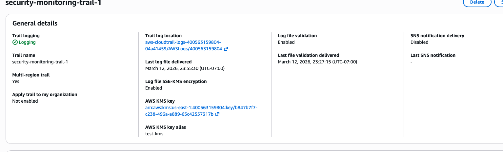
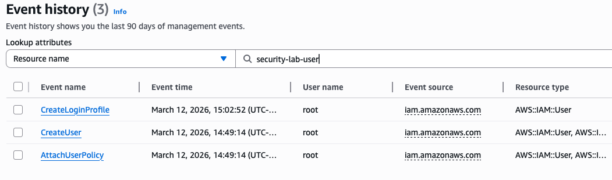
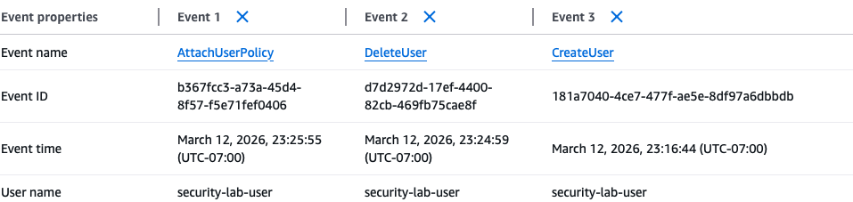
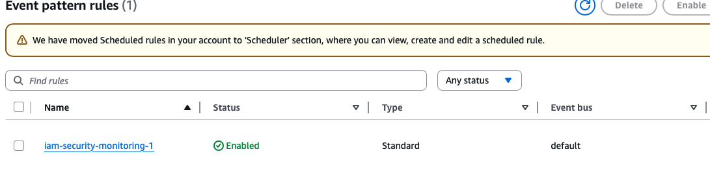
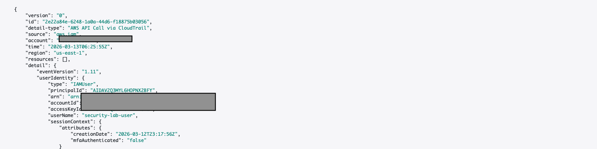
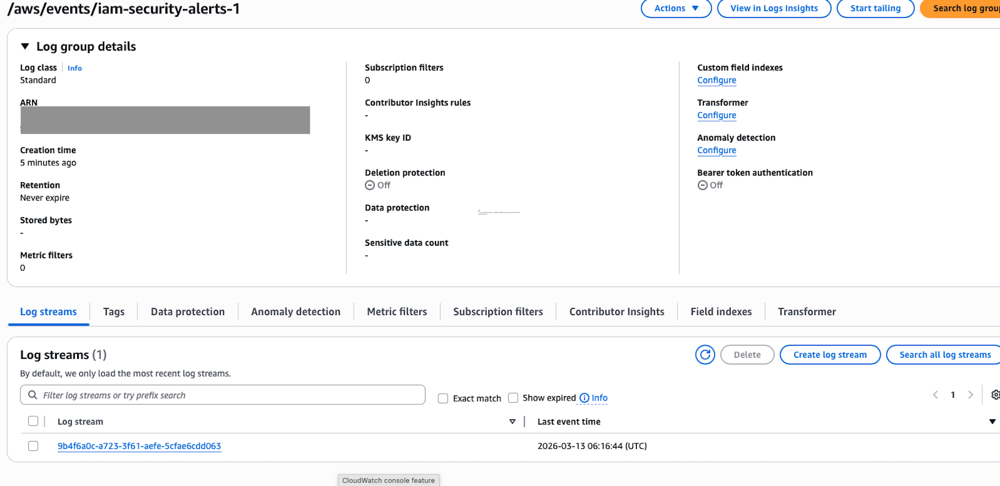

# AWS Cloud Security Monitoring Lab
Overview
This project demonstrates how to monitor AWS administrative activity using native cloud security services. The lab simulates IAM management actions and captures them through AWS audit logging and event monitoring tools.
The objective is to build a simple cloud security monitoring pipeline capable of detecting privileged IAM actions.
Architecture
## The monitoring workflow implemented in this lab is shown below:

---

```
IAM Administrative Activity
        ↓
AWS CloudTrail
        ↓
Amazon EventBridge Rule
        ↓
Amazon CloudWatch Logs
```
---
This pipeline allows security teams to detect and investigate administrative changes within an AWS environment.
Technologies Used
AWS CloudTrail
Amazon EventBridge
Amazon CloudWatch Logs
AWS Identity and Access Management (IAM)
Lab Setup

## Step 1 – Enable CloudTrail Logging
A multi-region CloudTrail trail was created to capture management events across the AWS account.
Key settings:
Management events enabled
Read and Write API activity logged
Logs stored in an S3 bucket
Log file validation enabled

### Evidence



## Step 2 – Simulate IAM Administrative Activity
Several IAM administrative actions were performed to simulate security-relevant events:
Create IAM user
Attach policy to IAM user
Delete IAM user
These actions represent privileged operations that security teams monitor.

## Step 3 – Verify Events in CloudTrail
CloudTrail recorded the IAM actions as management events.
Examples of captured events:
CreateUser
AttachUserPolicy
CreateLoginProfile
DeleteUser

### Evidence




## Step 4 – Inspect Event Details
Detailed event logs show the source service, user identity, and affected resources.
This information is used during security investigations and incident response.

### Evidence



## Step 5 – Create EventBridge Detection Rule
An EventBridge rule was created to detect IAM API calls captured by CloudTrail.
Rule configuration:
Event source: IAM
Event type: AWS API Call via CloudTrail

### Evidence



## Step 6 – Capture Security Events in CloudWatch
The EventBridge rule forwards detected IAM activity to a CloudWatch log group.
This allows automated monitoring and centralized logging of administrative actions.

### Evidence



## Step 7 – Review Security Event Logs
CloudWatch logs contain the full event record including the IAM action, source identity, and request details.
These logs can be used for:
Incident response
Forensic investigation
Security monitoring

### Evidence



# Real-World Security Use Case

Cloud security teams monitor privileged IAM activity to detect unauthorized administrative changes. Actions such as creating new users or attaching policies may indicate privilege escalation or account compromise.

The monitoring pipeline implemented in this lab can help detect events such as:

- Unauthorized creation of IAM users
- Privilege escalation through policy attachment
- Suspicious administrative activity performed by the root account
- Unauthorized deletion of users or permissions

By using CloudTrail logs combined with EventBridge detection rules, organizations can automatically detect and investigate suspicious activity within their AWS environments.

## Security Concepts Demonstrated
This lab demonstrates several key cloud security capabilities:
Cloud audit logging
Monitoring privileged IAM actions
Detecting administrative changes
Event-driven security monitoring
Centralized log analysis
## Outcome
This project demonstrates how AWS native services can be used to implement basic cloud security monitoring.
By combining CloudTrail, EventBridge, and CloudWatch, security teams can automatically detect and log sensitive administrative activity within an AWS environment.
Skills Demonstrated
AWS security monitoring
IAM activity auditing
CloudTrail configuration
EventBridge event detection
CloudWatch log analysis
Cloud security architecture

## Skills Demonstratede
AWS security monitoring
IAM activity auditing
CloudTrail configuration
Event-driven detection using EventBridge
CloudWatch log analysis
Cloud security architecture

