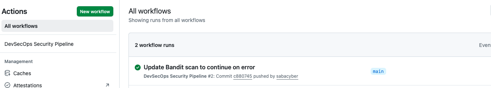
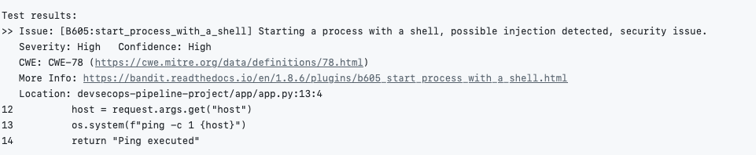
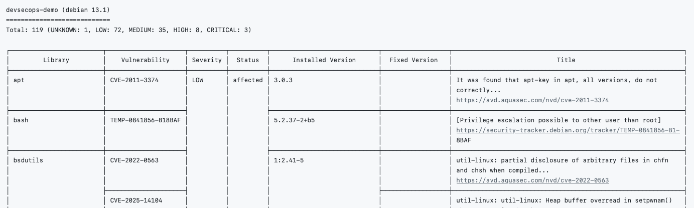

# DevSecOps Security Pipeline

This project demonstrates how security can be integrated directly into the CI/CD pipeline using automated security scanning tools. The goal of this lab is to implement a DevSecOps workflow that automatically detects vulnerabilities in application code and container images during the build process.
The pipeline uses GitHub Actions to perform automated security testing whenever code is pushed to the repository.

---

## Lab Environment
The pipeline was built using the following tools:
### Tool	Purpose

---

GitHub Actions	CI/CD pipeline automation
--
Bandit	Python static application security testing (SAST)
--
Docker	Containerization of the application
--
Trivy	Container vulnerability scanning
--
Python Flask	Demo web application

---
## Pipeline Architecture
```
Developer Push Code
        ↓
GitHub Repository
        ↓
GitHub Actions CI/CD Pipeline
        ↓
Bandit Security Scan (Python Code)
        ↓
Docker Image Build
        ↓
Trivy Container Vulnerability Scan
```
This pipeline demonstrates how security checks can be automatically enforced during the development lifecycle.

---

## Security Scans Implemented
- The pipeline performs the following automated security checks:
- Static Application Security Testing (SAST)
- Container Image Vulnerability Scanning
- Automated CI/CD Security Validation

---

## 1. GitHub Actions CI/CD Pipeline

A GitHub Actions workflow was created to automate the security scanning process whenever new code is pushed to the repository.

The workflow performs the following tasks:

- Checkout repository code
- Install security scanning tools
- Perform static code analysis
- Build a Docker container image
- Scan the container for vulnerabilities
  
Evidence

---

## 2. Static Code Security Scan (Bandit)

Bandit is a static analysis tool designed to detect security issues in Python code.
During the pipeline execution, Bandit scans the application source code and identifies insecure coding patterns.
In this lab, Bandit detected a command injection vulnerability caused by the use of:
os.system()
This type of vulnerability can allow attackers to execute arbitrary commands on the system.

Evidence


---

## 3. Container Vulnerability Scan (Trivy)

After building the Docker image, the pipeline performs a vulnerability scan using Trivy.
Trivy analyzes the container image and identifies known vulnerabilities in:
- operating system packages
- installed libraries
- container dependencies
  
The scan detected multiple vulnerabilities with varying severity levels including HIGH and CRITICAL vulnerabilities.

Evidence


---

## Security Impact

Without automated security scanning, vulnerabilities in application code or container images could be deployed to production environments.

The DevSecOps pipeline helps organizations:

- detect vulnerabilities early in the development process
- prevent insecure code from reaching production
- enforce automated security policies in CI/CD workflows

---

## Skills Demonstrated

This project demonstrates practical skills in:
- DevSecOps pipeline implementation
- CI/CD security automation
- static application security testing
- container vulnerability scanning
- secure software development lifecycle (SSDLC)

  ---
  
## Real-World Security Use Case

Modern organizations integrate security directly into their CI/CD pipelines to ensure vulnerabilities are detected before deployment.

Security teams use tools like Bandit and Trivy to automatically scan code and container images for vulnerabilities as part of the DevSecOps workflow.

By automating these checks, organizations can maintain faster development cycles while improving the overall security posture of their applications.

## Portfolio Project Outcome
This project demonstrates how security can be integrated into modern software development pipelines through automated vulnerability detection and DevSecOps practices.
It showcases practical experience with CI/CD security automation used by cloud security engineers, DevSecOps engineers, and application security teams.
