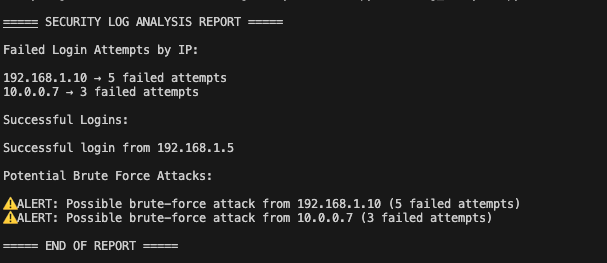

# SOC Log Analysis Lab

This project demonstrates how security teams analyze authentication logs to detect suspicious activity such as brute-force login attempts. The lab simulates a Security Operations Center (SOC) investigation by parsing system authentication logs and identifying potentially malicious behavior.

The analysis is performed using a Python log analyzer script that scans SSH authentication logs and generates a security report highlighting suspicious IP addresses and failed login attempts.

## Lab Environment
The lab was built using the lollowing tools:

| Tool               | Purpose                              |
| ------------------ | ------------------------------------ |
| Python             | Log parsing and threat detection     |
| macOS Terminal     | Running the analysis script          |
| Simulated SSH Logs | Authentication log data for analysis |

## Lab Architecture

Authentication Logs
        ↓
Python Log Analyzer
        ↓
Failed Login Detection
        ↓
Brute Force Attack Alerts
        ↓
Security Report Output

This workflow simulates how SOC analysts detect suspicious login activity using log analysis tools or SIEM platforms.

## Security Events Detected

The log analyzer detects the following security events:
- Failed SSH login attempts
- Successful SSH logins
- Suspicious IP addresses
- Potential brute-force attacks
These detections mimic the type of monitoring performed by SOC analysts using security monitoring platforms.

## 1. Authentication Log Analysis
A simulated SSH authentication log file was created to represent login attempts recorded by a Linux server.

Example log entries include:

Failed password for root from 192.168.1.10 port 22
Accepted password for user from 192.168.1.5 port 22

These logs represent typical authentication activity that SOC analysts monitor for suspicious behavior.

## 2. Python Log Analyzer Script

A Python script was developed to parse the authentication log file and extract relevant security information.

The script performs the following tasks:

- Reads authentication log entries
- Extracts IP addresses from failed login attempts
- Counts repeated failed logins
- Detects potential brute-force attacks
- Generates a security analysis report
  
The script uses regular expressions to identify login patterns and analyze authentication events.

## 3. Brute Force Attack Detection

If an IP address generates multiple failed login attempts, the script flags the activity as a potential brute-force attack.
Example detection logic:

if attempts >= 3:
    print("Possible brute-force attack detected")
    
This logic mimics how security monitoring systems detect repeated authentication failures from the same source.

## 4. Security Analysis Report
After analyzing the logs, the script generates a security report that summarizes suspicious activity detected during the analysis.

The report includes:

- failed login attempt counts
- successful login events
- IP addresses involved in suspicious activity
- brute-force attack alerts
  
Evidence

## Security Impact

Repeated failed authentication attempts often indicate brute-force password attacks. Attackers attempt multiple login combinations in order to gain unauthorized access to a system.

Without monitoring authentication logs, organizations may fail to detect these attacks before a system compromise occurs.
Security log analysis allows SOC teams to detect and respond to suspicious activity quickly.

## Skills Demonstrated

This project demonstrates practical skills in:
- security log analysis
- threat detection using Python
- brute-force attack identification
- SOC monitoring workflows
- security investigation techniques

## Real-World Security Use Case

Security Operations Centers continuously monitor authentication logs from servers, cloud platforms, and network devices. These logs are often ingested into SIEM platforms such as Splunk, Elastic SIEM, or Microsoft Sentinel.

Detection rules similar to the logic used in this project are commonly deployed to identify suspicious login patterns, detect brute-force attacks, and trigger security alerts for further investigation.

## Project Outcome

This lab demonstrates how authentication log analysis can be used to identify suspicious activity and detect potential brute-force attacks. By automating log analysis with Python, security analysts can quickly identify threats and respond to security incidents.

## Portfolio Project Summary

This project showcases practical experience with SOC-level security monitoring and log analysis techniques used to detect malicious activity in real-world environments.
