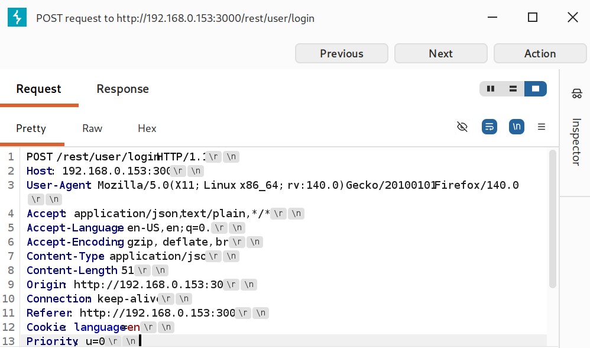
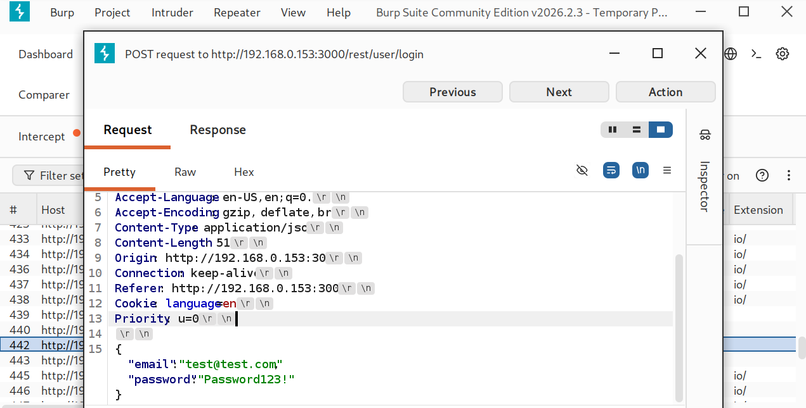
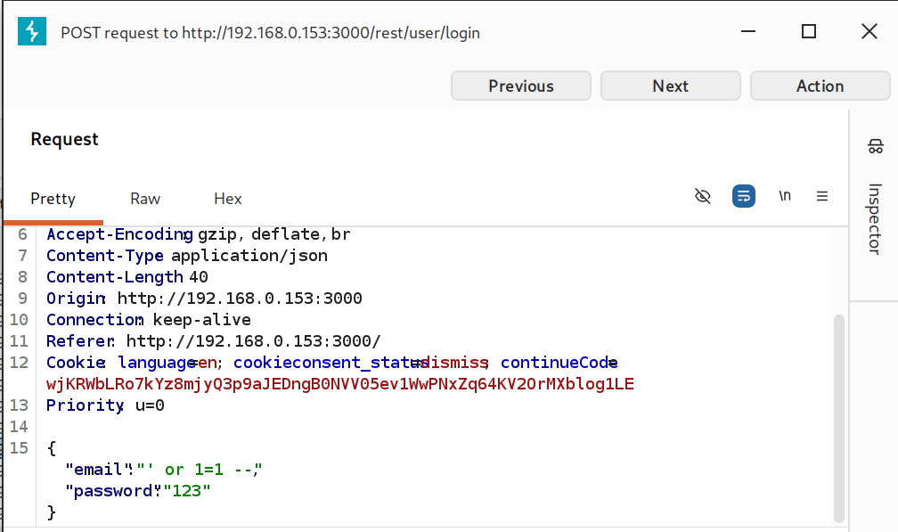
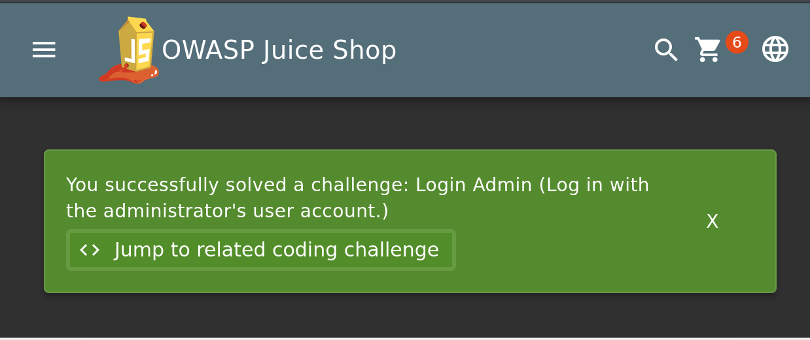
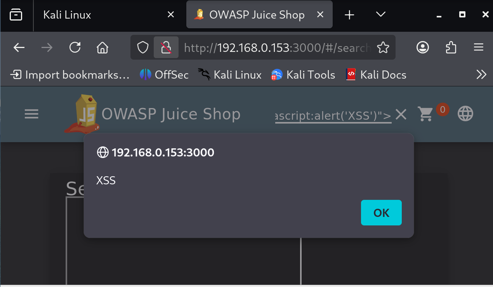
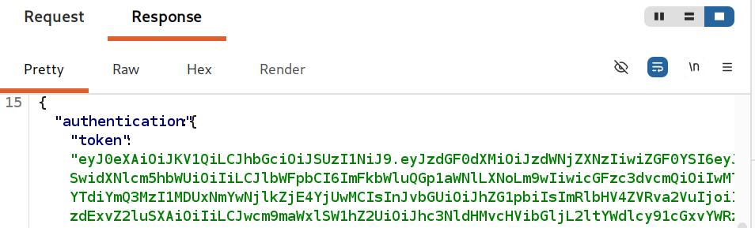

# Web Application Security Testing Lab

This project demonstrates hands-on testing of common web application vulnerabilities using an intentionally vulnerable application. The goal of the lab is to practice identifying, exploiting, and documenting security flaws in a controlled environment.

The testing environment uses **OWASP Juice Shop**, one of the most widely used training platforms for learning web security.

---

## Lab Environment

The lab was built using the following tools:

| Tool | Purpose |
|-----|------|
| OWASP Juice Shop | Vulnerable web application |
| Burp Suite | Web proxy for intercepting HTTP requests |
| Kali Linux | Security testing environment |
| Docker | Deployment of the Juice Shop application |
| Firefox Browser | Web interaction and testing |

---

## Lab Architecture

```
Firefox (Kali Linux)
        ↓
Burp Suite Proxy (127.0.0.1:8080)
        ↓
OWASP Juice Shop
        ↓
Docker Container
```

This setup allows interception and analysis of HTTP requests between the browser and the web application.

---

## Vulnerabilities Demonstrated

The following vulnerabilities were tested during this lab:

- Cross-Site Scripting (XSS)
- SQL Injection
- Authentication Request Interception
- JWT Authentication Token Analysis

---

# 1. Intercepting Login Requests

Using **Burp Suite**, the login request was intercepted to analyze how authentication data is transmitted between the browser and the server.

Example intercepted request:

```
POST /rest/user/login HTTP/1.1
Host: 192.168.x.x:3000
Content-Type: application/json
```

Request body:

```json
{
 "email": "test@test.com",
 "password": "Password123!"
}
```

This demonstrates how attackers can inspect authentication traffic.

### Evidence





---

# 2. SQL Injection – Authentication Bypass

A SQL injection payload was used in the login form:

```
' OR 1=1 --
```

This payload manipulates the backend SQL query, allowing authentication to succeed without a valid password.

Result:

The application logged in as the administrator account and displayed the message:

```
You successfully solved a challenge:
Login Admin
```

### Evidence





---

# 3. Cross-Site Scripting (XSS)

A malicious script was injected through the application search feature.

Payload used:

```
<script>alert("XSS")</script>
```

Result:

The browser executed the injected script, demonstrating a Cross-Site Scripting vulnerability.

### Evidence



---

# 4. JWT Authentication Token Analysis

After successful login, the application returned a JSON Web Token (JWT) used for authentication.

Example response:

```json
{
 "authentication": {
   "token": "eyJhbGciOiJIUzI1NiIsInR5cCI6IkpXVCJ9..."
 }
}
```

JWT tokens store authentication information and are commonly used in modern web applications.

### Evidence



---

## Security Impact

These vulnerabilities can allow attackers to:

- bypass authentication  
- execute malicious scripts in user browsers  
- intercept and analyze authentication data  
- manipulate application requests  

---

## Mitigation Strategies

Common defenses against these vulnerabilities include:

- input validation  
- parameterized database queries  
- output encoding  
- secure authentication token handling  
- Content Security Policy (CSP)  

---

## Skills Demonstrated

This project demonstrates practical skills in:

- Web application security testing  
- HTTP request interception  
- Vulnerability analysis  
- Authentication flow analysis  
- Security documentation  

---

## Outcome

This lab provides hands-on experience with real-world web security testing techniques used by penetration testers and application security engineers.
